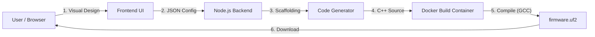

# PicoForge ⚡🛠️


**PicoForge** is a modern, browser-based visual programming environment designed specifically for the Raspberry Pi Pico (RP2040). It bridges the gap between drag-and-drop simplicity and professional C++ development by generating valid, compiled Pico SDK code in real-time.

---

## 🚀 Key Features

*   **Visual Logic Builder**: Drag-and-drop support (using `@dnd-kit`) for GPIO, SPI, I2C, ADC, PWM, and Flow Control.
*   **Live Architecture Preview**: Real-time system visualization using dynamic **Mermaid** diagrams.
*   **Dockerized Build Toolchain**: Compiles C++ code for RP2040 in a containerized environment—no local toolchain installation required.
*   **Reusable Functions**: Visually define C++ functions with steps and call them endlessly in your main loop.
*   **Smart Validation**: 
    *   Prevents pin conflicts (e.g., using a pin for both SPI and GPIO).
    *   Enforces hardware constraints (e.g., valid SPI0 vs SPI1 pins).
    *   Auto-links config blocks to their actions.
*   **Production-Ready Code**: Generates clean, commented `main.cpp` and `CMakeLists.txt` that auto-detects required libraries (`hardware_spi`, `hardware_pwm`, etc.).

---

## 🏗️ Architecture & Flow

PicoForge uses a containerized microservices architecture to ensure consistent, reproducible builds across any OS.



### Core Components
*   **Frontend (`/web/frontend`)**: A React application built with Vite and Tailwind CSS. It handles the block logic, validation, and state management.
*   **Backend (`/web/backend`)**: A Node.js Express API. It acts as the orchestrator, managing project files and spinning up build containers.
*   **Build Environment (`/docker`)**: A custom Alpine Linux Docker image pre-loaded with the official `pico-sdk`, `cmake`, and `arm-none-eabi-gcc`.

---

## 📂 Project Structure

```bash
d:\apps\picoforge
├── 📂 web
│   ├── 📂 frontend       # React UI: Visual Builder, Components, Mermaid Preview
│   └── 📂 backend        # Node.js API: Scaffold Service, Project Management
├── 📂 docker             # Dockerfiles defining the dev and build environments
├── 📂 workspace          # Persistent volume for User Projects & Build Artifacts
├── 📄 docker-compose.yml # Orchestration for all services (frontend, backend, builder)
└── 📄 README.md          # Documentation
```

---

## 🛠️ Getting Started

### Prerequisites
*   **Docker Desktop** (Ensure it is running)
*   **Git**

### Installation & Running
1.  **Clone the repository**:
    ```bash
    git clone https://github.com/yourusername/picoforge.git
    cd picoforge
    ```

2.  **Start the environment**:
    This command builds the frontend, backend, and compile-toolchain containers.
    ```bash
    docker-compose up -d --build
    ```

3.  **Access PicoForge**:
    Open your browser to `http://localhost:8080`.

### Usage Guide
1.  **Create Project**: Click "New Project", give it a name (e.g., `blink-led`).
2.  **Setup Hardware**: 
    *   Drag **Setup blocks** (e.g., `SPI CONFIG`, `PWM CONFIG`) into the **Setup** section.
    *   *Validation checks will ensure you pick valid hardware pins.*
3.  **Define Logic**: 
    *   Drag **Action blocks** (e.g., `GPIO SET`, `SPI WRITE`, `WAIT`) into the **Loop** section.
    *   *Create custom functions using the `Function Def` block.*
4.  **Visualize**: Check the "Architecture Preview" card to see a generated diagram of your system.
5.  **Build**: Click the **Build** button. The backend generates the C++ code and compiles it.
6.  **Flash**: When the build finishes, a `project.uf2` file will download. Drag this to your Pico (mounted as RPI-RP2).

---

## 🤝 Contributing

Contributions are welcome!
1.  Fork the repo.
2.  Create a feature branch (`git checkout -b feature/amazing-feature`).
3.  Commit your changes.
4.  Push to the branch.
5.  Open a Pull Request.

---

## 📄 License
MIT License - see [LICENSE](LICENSE) for details.
